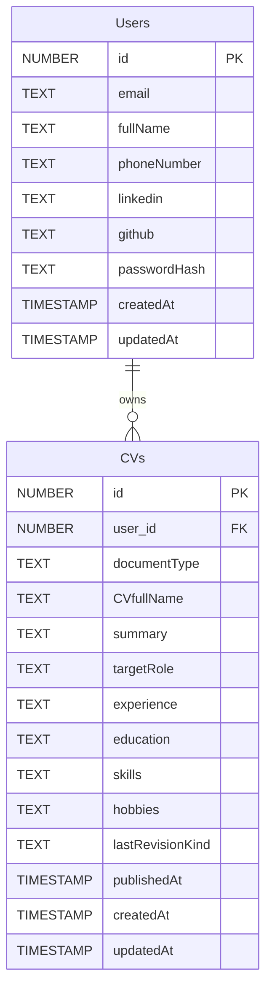

# Entity Relationship Diagram

```mermaid
erDiagram
    Users {
        NUMBER id PK
        TEXT email
        TEXT fullName
        TEXT phoneNumber
        TEXT linkedin
        TEXT github
        TEXT passwordHash
        TIMESTAMP createdAt
        TIMESTAMP updatedAt
    }

    CVs {
        NUMBER id PK
        NUMBER user_id FK
        TEXT documentType
        TEXT CVfullName
        TEXT summary
        TEXT targetRole
        TEXT experience
        TEXT education
        TEXT skills
        TEXT hobbies
        TEXT lastRevisionKind
        TIMESTAMP publishedAt
        TIMESTAMP createdAt
        TIMESTAMP updatedAt
    }

    Users ||--o{ CVs : "owns"
```
